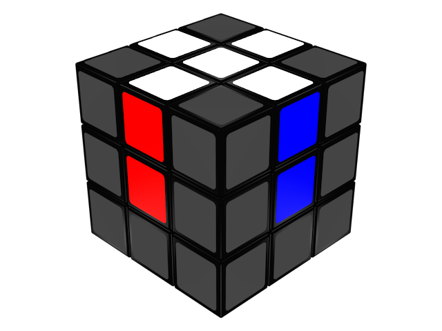
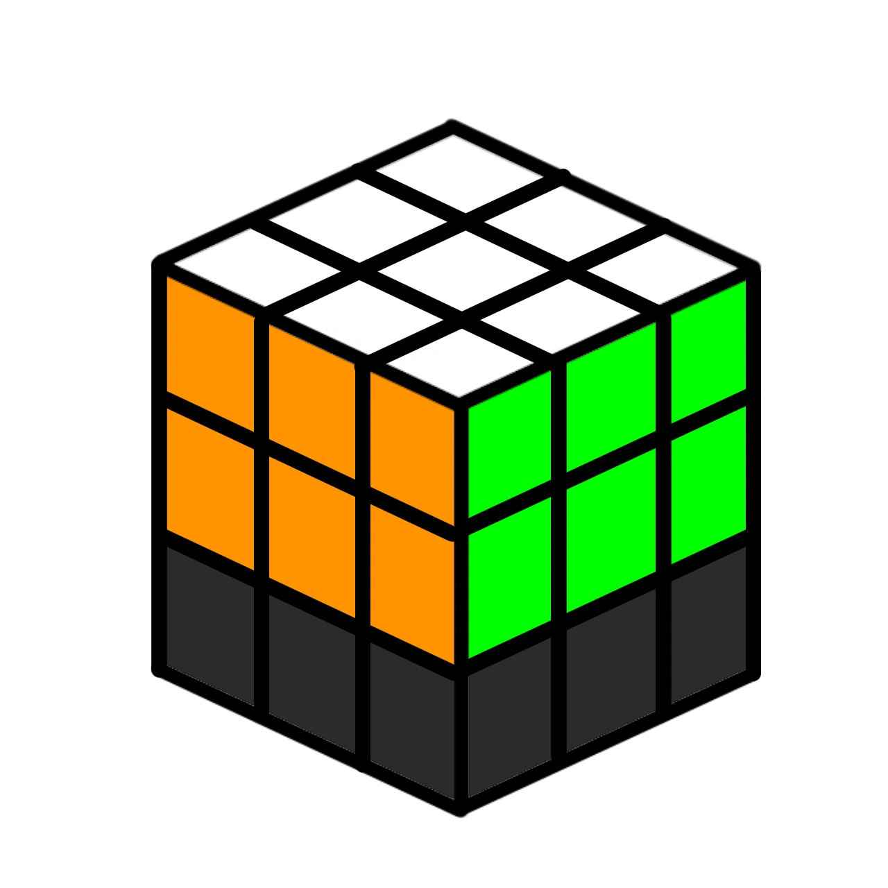
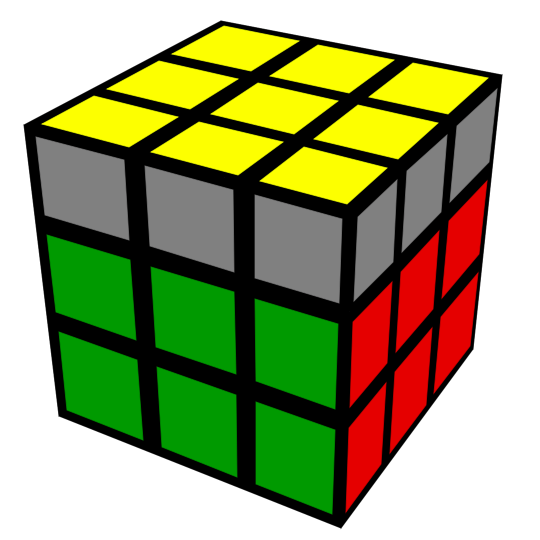
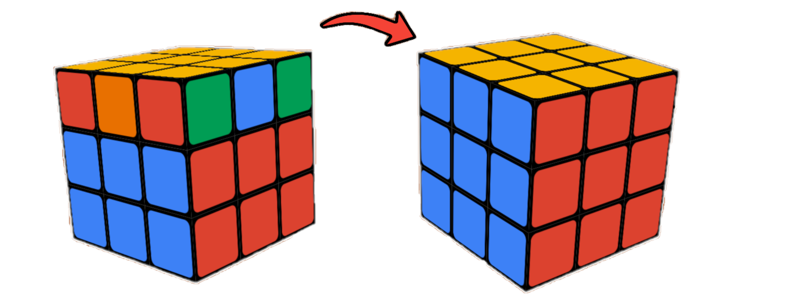
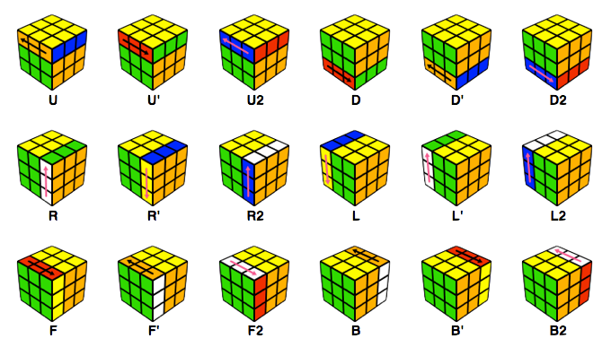

# Where is the math in the Rubik's Cube? by Daniela G. Peraza Pichardo
This repository explores the mathematical principles behind the best-selling toy in history: the Rubik's Cube. While the Rubik's Cube is often seen only as a mechanical puzzle from the 80's, it is deeply connected to several areas of mathematics, in particular, group theory and permutations.

-----------------------------------------------------------------------------------------

The objective of this project is to understand the Rubik's Cube through mathematical concepts, to describe its possible configurations, and to analyze the algorithms used to solve it through this mathematical perspective. As mentioned earlier, the Rubik’s Cube may appear as a mere entertaining puzzle, but each move performed in any of its faces rearranges its pieces according to precise rules. Therefore, by representing the changes in the pieces' configuration as permutations, it is possible to create a model that helps understand the cube’s behavior, which could even predict the resulting rearrangement of entire sequences of face rotations.

The motivation for this project comes from my personal interest in _speedcubing_, a hobby that consists of solving the Rubik’s Cube and its variants in the shortest possible time, which relies on pattern recognition and memorized algorithms. Hence, it is precisely the need of _algorithms_ in the last two steps of cube-solving which provokes the question of what the math behind these _algorithms_ looks like and most importantly why they work. In other words, the aim is, through the study of permutations and commutators, to show how group theory provides a framework for predicting and controlling the movement of cube pieces.

To better appreciate the mathematics behind the Rubik's Cube, it is useful to first understand how the puzzle is typically solved. Modern speedsolving methods, such as **CFOP (Cross, First Two Layers, Orientation of the Last Layer, and Permutation of the Last Layer)**, divide the solution process into several stages.

The first step is the **cross**, where four edge pieces are positioned and oriented correctly relative to one another. This stage is usually solved intuitively, meaning that the solver analyzes the cube and determines the necessary moves without relying on memorized algorithms.

The second stage is known as **First Two Layers (F2L)**. Here, corner-edge pairs are inserted into their correct slots to simultaneously solve the first and second layers of the cube. While advanced solvers often learn specialized algorithms to perform F2L efficiently, the process can largely be understood through logical reasoning and visualization. A solver identifies a corner and its matching edge, pairs them together, and inserts them into the correct position. Because only a small number of pieces are involved at a time, many beginners are able to discover solutions on their own without extensive memorization.

However, as the cube becomes more solved, the problem becomes more and more complex. Once the first two layers are completed, it is only the last layer which remains unsolved. This is where the transition from intuitive solving to algorithmic solving occurs.

The first last-layer step is called **Orientation of the Last Layer (OLL)**. The goal is to rotate all last-layer pieces so that the entire top face becomes a single color, usually yellow. It is important to mention that OLL does not necessarily place the pieces in their correct positions; it only ensures that they are **facing** the correct direction. Depending on the arrangement of the last-layer pieces, there are 57 possible OLL cases, each with its own algorithm. Experienced solvers learn to recognize these patterns and apply the corresponding sequence of moves in a matter of just a couple of seconds.

Once all last-layer pieces are correctly oriented, the solver proceeds to **Permutation of the Last Layer (PLL)**. During this step, the pieces are already facing the correct direction, but many of them remain in the wrong locations. The objective of PLL is to **move the pieces into their correct positions without changing their orientation**. There are 21 possible PLL cases, each solved by a different algorithm. After applying the appropriate PLL algorithm, the cube becomes **completely solved**.

What makes OLL and PLL particularly interesting for this project is that the algorithms used are carefully designed permutations of cube pieces. Rather than moving every cubie randomly, these algorithms affect only specific regions of the cube while preserving most of the cube that has already been solved. ThHence, the algorithms can be analyzed as permutations of individual cube pieces.

Below is the link to a motivaional video that inspired and guided the development of this project. The video explores the mathematical ideas behind Rubik's Cube algorithms and explains how solving methods are connected to concepts such as permutations, commutators, and group theory.

https://youtu.be/_Zv3YcQeNVI

Rather than presenting algorithms as sequences of moves to be memorized, the video investigates why certain algorithms work and how they manipulate specific cube pieces while leaving others unchanged. It introduces the concept of commutators, which is a fundamental tool which will be used in the analysis of algorithms, and discusses the challenges of understanding increasingly complex algorithms due to the enormous number of possible cube configurations.

This resource is particularly helpful because it bridges the gap between practical cube solving and the mathematical structures that govern it. It provides an accessible introduction to the ideas that are developed more rigorously in the technical section of this repository, helping readers understand how abstract mathematical concepts can be applied to analyze and solve a real-world puzzle.

-----------------------------------------------------------------------------------------

## PRESENTING THE PROPOSAL
The following video presents the initial proposal for this project, _The Math Behind the 3×3 Rubik's Cube_. In this video, the main objectives of the project are introduced, as well as the mathematical concepts required to analyze the puzzle, and the motivation for studying the Rubik's Cube from a mathematical perspective. It also introduces fundamental concepts such as cycle notation, composition of permutations, and the commutator, which serves as one of the key mathematical tools used throughout this project.

This video provides the foundation for the more detailed analysis presented in the **Hands-on** section of the repository. It is intended to help viewers understand the problem being investigated, the mathematical framework that will be used, and the questions that guide the development of the project, including how algorithms affect cube pieces and why certain cube configurations are impossible to obtain through legal moves.

https://youtu.be/mN8gmh6tW7c

-----------------------------------------------------------------------------------------

## TECHNICALITIES OF THE PROJECT

### MOTIVATION

A standard 3×3 Rubik's Cube has approximately 4.3 × 10¹⁹ possible configurations, meaning that there are more than 43 quintillion ways to arrange its pieces. Despite this enormous complexity, every **legal move** follows precise mathematical rules.

Each face rotation rearranges the cube's pieces and since these rearrangements correspond to permutations of the cube pieces, the Rubik's Cube can be studied using permutations and group theory. In this repository, the focus is set particularly on the last-layer solving stages known as **OLL (Orientation of the Last Layer)** and **PLL (Permutation of the Last Layer)** which we had already mentioned.

### RUBIK'S CUBE NOTATION

Before constructing a mathematical model, it is necessary to establish a notation for describing cube movements. Supposing the cube is facing an arbitrary direction, with one face facing toward us, the six faces of the cube are denoted by the letters:

**U (Up)**

**D (Down)**

**F (Front)**

**B (Back)**

**R (Right)**

**L (Left)**

A letter by itself represents a **90-degree clockwise rotation** of that face. For example: [R]

A prime symbol indicates a **90-degree counterclockwise rotation**: [R']

A number 2 indicates a **180-degree rotation**: [R2]

These symbols allow move sequences, commonly called algorithms, to be written in a more standardized way.

### IDENTIFYING CUBE PIECES

To refer to an individual cubie, or cube piece, we use as many letters as stickers on them are. The letters used are the ones that correspond to the side of the cubie we are referring to. The cube consists of three types of cubies:

#### Centers

Center pieces have one visible sticker and are identified by a single letter.

Examples:

U, D, F, B, R, L

#### Edges

Edge pieces have two stickers and are identified by two letters.

Examples:

UF, UB, UL, UR, ...

#### Corners

Corner pieces have three stickers and are identified by three letters.

Examples:

UFR, UFL, UBR, UBL, ...

### PERMUTATIONS

A permutation is a rearrangement of objects. As an example:

(1 2 3)

1→2,  2→3,  3→1

Every move of the Rubik's Cube can be viewed as a permutation because it rearranges the positions of **corner and edge** cubies. Center cubies never move from their place, they only rotate, hence they will be omitted in the permutations. For example, a U move rotates the top layer and cycles the four upper corners:

(UFR UBR UBL UFL)

This means:

**UFR moves to UBR**

**UBR moves to UBL**

**UBL moves to UFL**

**UFL moves to UFR**

Similarly, the upper edges are permuted according to:

(UF UR UB UL)

Therefore, the complete permutation produced by U is

U = (UFR UBR UBL UFL)(UF UR UB UL)

Cycle notation therefore provides a precise description of how cube pieces move. 

### GROUPS

A group is a mathematical structure consisting of a set together with an operation satisfying four properties.

Let _G_ be a set and let (*) be an operation on its elements. We can represent cube permutations as group elements. We will call the group of permutations 𝑅, where the operator * is a concatenation of sequences of cube moves, or rotations of a cube’s face. However, the * will be omitted in cube notation.

#### Closure

For any group elements _h_ and _g_ that are in _G_, _h∗g_ is also in _G_

Combining two permutations will result in a valid permutation in the Rubik's Cube which can be reached through legal moves.

#### Identity

There is an element _e_ in _G_ such that _e∗g = g∗e = g_

For the Rubik's Cube, the identity corresponds to leaving the cube unchanged.

#### Inverse

Every element _g_ in G has an inverse _g^(−1)_ relative to the operation * such that _g∗g^(−1) = g^(−1)∗g = e_

Every cube move can be undone. For example: _RR' = R'R = e_

#### Associativity

The operation * is associative, so for any elements _f_, _g_, and _h_, _(f∗g)∗h = f∗(g∗h)_

This means that performing the permutation produced by _(f∗g)_ and then combining it with the permutation produced by _h_ will result in the same permutation as performing the permutation produced by _f_ followed by the permutation produced by the combination of _(g∗h)_

Because all four properties are satisfied, the set of cube permutations forms a group.

#### Important Group Theorems

Several basic results from group theory are useful in the analysis of cube algorithms:

The identity element _e_ is unique.

If 𝑎∗𝑏 = ⅇ, then 𝑎 = 𝑏^(−1)

If 𝑎∗𝑥 = 𝑏∗𝑥, then 𝑎 = 𝑏

The inverse of (𝑎𝑏) is 𝑏^(−1) 𝑎^(−1)

(𝑎^(−1) )^(−1) = 𝑎

These results allow us to manipulate move sequences algebraically and simplify expressions involving cube algorithms.

### THE COMMUTATOR

One of the most important structures in Rubik's Cube solving is the commutator.

Given two move sequences _A_ and _B_, the commutator is defined as

_[A,B]_ = _ABA^(-1)B^(-1)_

The idea behind the commutator is simple:

Perform move sequence _A_.
Perform move sequence _B_.
Undo _A_.
Undo _B_.

An example commutator would be:

_[R,U]_ = _RUR^(-1)U^(-1)_

#### Why the Commutator Works

The Rubik's Cube group is non-abelian, also called non-commutative group, meaning that the order of operations matters.

In general,

𝐴𝐵≠𝐵𝐴 → 𝑅𝑈≠𝑈𝑅

However, if the chosen two moves affect completely different sets of cubies, or if they are the same operation then they are commutative.

𝐴𝐵 = 𝐵𝐴

𝐴𝐵𝐴^(−1)𝐵^(−1) = ⅇ

𝐴𝐵𝐴^(−1)𝐵^(−1) = 𝐵𝐴𝐴^(−1) 𝐵^(−1) = 𝐵𝐵^(−1) = ⅇ

If the whole cube group were commutative, for all _A_ and _B_, then commutators would have no effect.

Instead, because the cube is non-commutative, commutators produce controlled permutations of a small number of pieces. This is precisely why they are useful for designing solving algorithms.

### APPLICATION TO OLL AND PLL

During the first stages of solving, many moves can be found rather intuitively. However, once the first two layers are completed, the remaining cases become significantly more complex.

In **OLL (Orientation of the Last Layer)**, the goal is to orient all last-layer pieces so that the top face becomes a single color.

In **PLL (Permutation of the Last Layer)**, the pieces are already correctly oriented, but must be moved into their correct locations.

Many OLL and PLL algorithms can be analyzed using permutations and commutators. Rather than affecting the entire cube, these algorithms are carefully designed to move only specific corners or edges while preserving solved sections.

From a mathematical perspective, each OLL or PLL algorithm corresponds to a particular permutation in the Rubik's Cube group.

We choose an arbitrary algorithm from the extense list of OLL (https://www.jperm.net/algs/oll) and PLL (https://www.jperm.net/algs/pll) algorithms found in the solving manuals. For example, case 27 from OLL:

_R U R' U R U2 R'_

We define the permutation for each move first:

_R = (UFR DFR DBR UBR)(UR FR DR BR)_

_U = (UFR UBR UBL UFL)(UF UR UB UL)_

_R′ = (UFR UBR DBR DFR)(UR BR DR FR)_

_U2 = (UFR UBL)(UBR UFL)(UF UB)(UR UL)_

We track the positions, which results in:

_R U R' U R U2 R'_ = _(UFR UBR UFL)(UF UR UB)_

This algorithm preserves most of the cube, cycles only a small set of top-layer pieces, changes the orientation of specific corners, and leaves edge orientations unchanged.

### WHY GROUP THEORY IS NECESSARY

Without group theory, solving algorithms often appear to be arbitrary sequences of moves that must simply be memorized.

Group theory provides a deeper explanation by showing:

  -Which cubies are being permuted.
  
  -Why certain algorithms affect only specific pieces.
  
  -Why some cube configurations are impossible.
  
  -How algorithms can be constructed systematically using commutators and conjugates.

Instead of viewing algorithms as random move sequences, we can understand them as mathematical objects with predictable effects.

### ALTERNATIVE APPROACHES

Other mathematical and computational approaches can be used to study the Rubik's Cube.

#### Brute-Force Search

Attempts many possible move sequences until a solution is found.

#### Computer Enumeration

Systematically generates and analyzes all reachable cube states.

#### Graph Theory

Models cube configurations as vertices and legal moves as edges connecting them.

Although these methods can solve or analyze the cube, they do not explain the underlying structure of solving algorithms as naturally as group theory does. For this reason, permutations and group theory provide the most suitable framework for understanding the mathematics behind the Rubik's Cube.

-----------------------------------------------------------------------------------------

## CONCLUSIONS

-----------------------------------------------------------------------------------------

## REFERENCES
